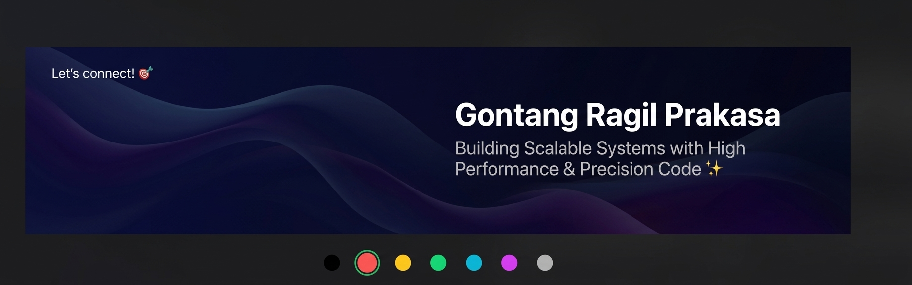

<div align="center">



<br><br>

# Gontang Ragil Prakasa

### Senior Software Engineer | Backend & Fullstack Engineer

Building scalable software, distributed systems, and reliable integrations.

<p>
  <a href="https://www.linkedin.com/in/gontang-ragil-prakasa-65766b131/">
    
  </a>
  <a href="https://github.com/GontangRagilPrakasa">
    
  </a>
  <a href="https://gontangragilprakasa.com/">
    
  </a>
</p>

</div>

---

## 👨‍💻 About Me

I'm a **Senior Software Engineer** with 10+ years of experience
building backend systems, APIs, integrations, and fullstack applications.

My main focus is building software that is:

- Scalable
- Maintainable
- Reliable
- Easy to integrate
- Designed around real business requirements

I enjoy working on complex engineering problems, improving existing
systems, and turning business requirements into practical technical
solutions.

---

## 🧑‍💻 What I Do

- Backend Engineering
- API & System Integration
- Microservices Architecture
- Distributed Systems
- E-commerce & Logistics Systems
- Shopify App & Plugin Development
- WordPress Plugin Development
- AI-powered Applications
- System Refactoring & Optimization
- Infrastructure & DevOps

---

## 🛠️ Tech Stack

### Languages

<p>
  
</p>

### Backend

<p>
  
</p>

### Frontend

<p>
  
</p>

### Databases

<p>
  
</p>

### Infrastructure

<p>
  
</p>

---

## 🏗️ Engineering

Areas I work with:

```text
Backend
├── REST API
├── GraphQL
├── Microservices
├── Distributed Systems
├── Event Driven Architecture
├── Background Workers
└── Message Queues

System Integration
├── Third-party APIs
├── Webhooks
├── Shopify
├── WordPress
├── Payment Systems
└── Logistics / Shipping APIs

Infrastructure
├── Docker
├── Docker Compose
├── Linux
├── Nginx
├── Traefik
├── Cloud Infrastructure
└── Monitoring & Observability
